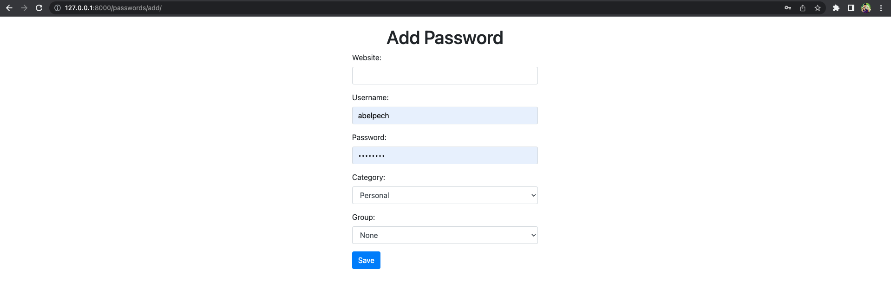

### Password Manager

1. `python3 -m venv virtualenv`
2. `source virtualvenv/bin/activate`
3. `git clone PROJECT_NAME`
4. `pip3 install -r password_manager/requirements.txt `
5. `python3 manage.py makemigrations`
6. `python3 manage.py migrate`
7. `python3 manage.py createsuperuser`
8. `python3 manage.py runserver`

Now, you can access your password manager at http://localhost:8000/passwords/ or http://localhost:8000/passwords/add or http://localhost:8000/admin. It will display a list of passwords fetched from the database.

